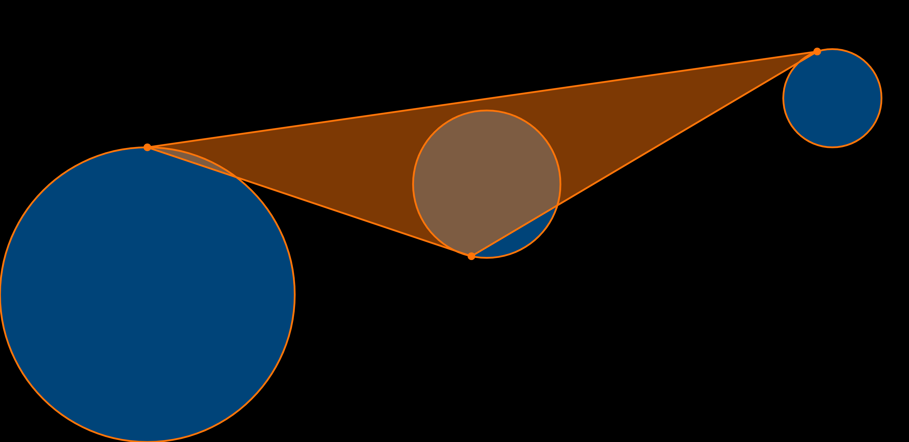
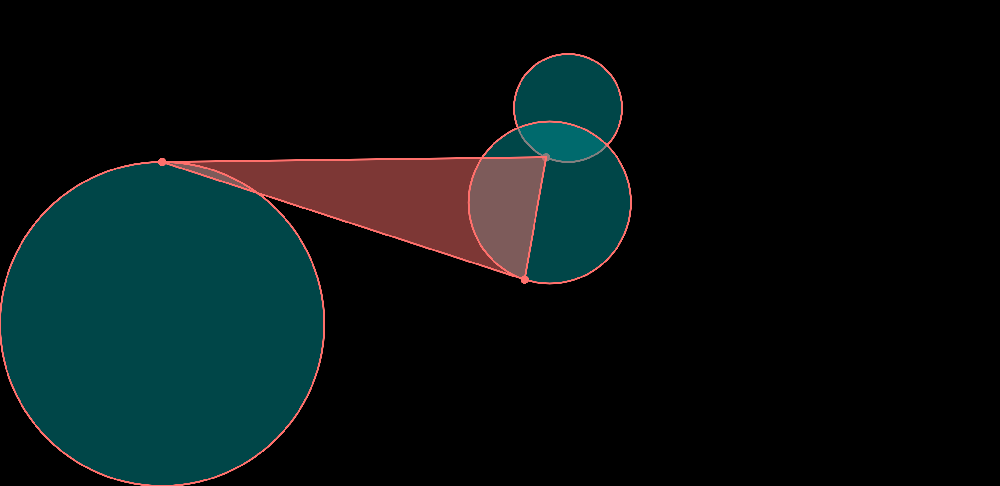
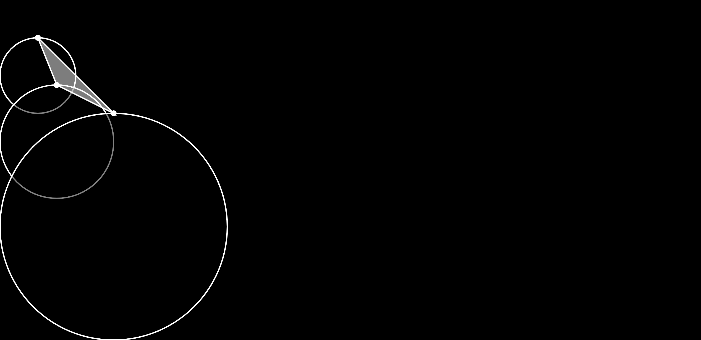

# HW04A Notes

This homework is to code a mechanism that keeps track of time. The three sub-divisions I chose are hour, minute, and second. 

Please view my real-time clock [here](https://6063-fuguoxue.github.io/HW04A/). 

## Plan
My initial plan was to draw three static concentric circles representing hour, minute, and second. Each of the circles has a moving dot on its edge, whose position follows the current time. The three dots are connected by straight lines. 

Another plan was to separate the three circles. To make the mechanism more interesting with more elements, I wanted to connect the three dots to form a triangle. 

I chose the 2nd plan because three separate circles can have more possibilities. For example, I could make them move around in the later stages of my process. 

Therefore, I created a sketch and calculated the relationship between a circle and the dot on its edge. 

### Implementation

#### Step 1: draw circles and dots

I started with the positioning of the circles and the dots. Since the logic for the three circle-dot sets is the same, I wrote the `drawCircle` function to complete these three tasks. Since the dot positions are required for the triangle drawing later, I let `drawCircle` return the x- and y-position. Then, in the `draw` function, I created a triangle using the three dots' positions. 

#### Step 2: use map() to move and color the shapes

To add some colors on the canvas, I got inspiration from the references: I let the stroke and fill color of the circles and the triangle change according to the current time. This was done by three simple `map()` functions: hour controls R, minute controls G, and second controls B. To create visual tension, I set the stroke and fill colors to be a complementary color combination. Moreover, I let the fill colors have an alpha value of 125, so another color will appear where the triangle and the circles overlap. 

Aside from colors, I let the three circles move as time passes. After translating the canvas, I used three `map()` functions to control the three circles' positions. 

I think this part is the most fun of this assignment. 

#### Step 3: the background color

Finally, I decided to use the hour to control the background color. I first used `background(colorR)`, but soon found that the brightest background appears at 0 o'clock. Since I wanted the background color to indicate night and day, I mapped the hour number differently in two situations: h<12 and h>=12. This is achieved by an if-else statement. I think the background color is the hardest part to deal with because it involves a mapping from linear to piecewise function. 

### Outcome

Below are screenshots of the final version of the mechanism. 

Below are screenshots for the time 00:00:00 and the time 23:59:59. 

